# РАЗРАБОТКА ИГРОВЫХ СЕРВИСОВ
### Ссылка на проект: https://github.com/A-Zaikin/DragonPicker
Отчет по лабораторной работе #2 выполнил:
- Заикин Александр Юрьевич
- РИ300012
Отметка о выполнении заданий (заполняется студентом):

| Задание | Выполнение | Баллы |
| ------ | ------ | ------ |
| Задание 1 | # | 60 |
| Задание 2 | # | 20 |
| Задание 3 | # | 20 |

знак "*" - задание выполнено; знак "#" - задание не выполнено;

Работу проверили:
- к.т.н., доцент Денисов Д.В.
- к.э.н., доцент Панов М.А.
- ст. преп., Фадеев В.О.

## Цель работы
Создание интерактивного приложения и изучение принципов интеграции в него игровых сервисов.

## Задание 1
### По теме видео практических работ 1-5 повторить реализацию игры на Unity. Привести описание выполненных действий
Ход работы:
#### Работа 1
1)	Создать новый проект из шаблона 3D.
2)	Добавить ассет с моделью дракона из Asset Store в свой аккаунт и импортировать его в проект через Package Manager.

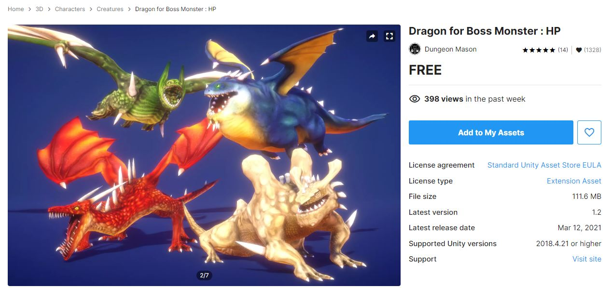

3)	Копировать префаб дракона в нашу папку и поставить на сцену.

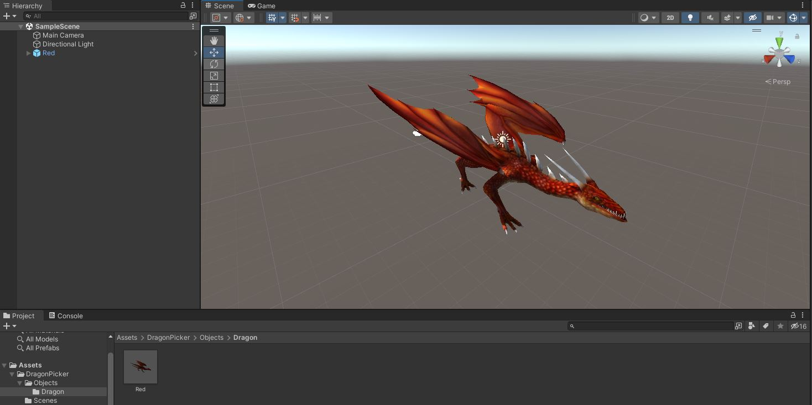

4)	Копировать анимацию FlyIdle, создать новый AnimationController, добавить в него анимацию, поставить Controller в компонент Animator дракона.

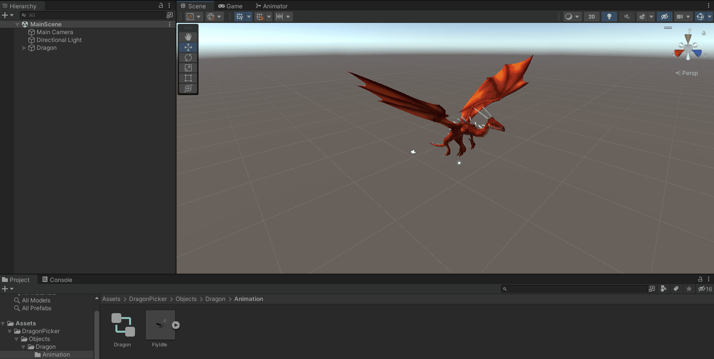

5) Создать сферу, удлиннить её вверх, добавить ей RigidBody (чтобы она падала), сохранить её как префаб Egg.
6) Скачать и добавить в проект бесплатную текстуру яица, создать материал и настроить его, добавить материал префабу.

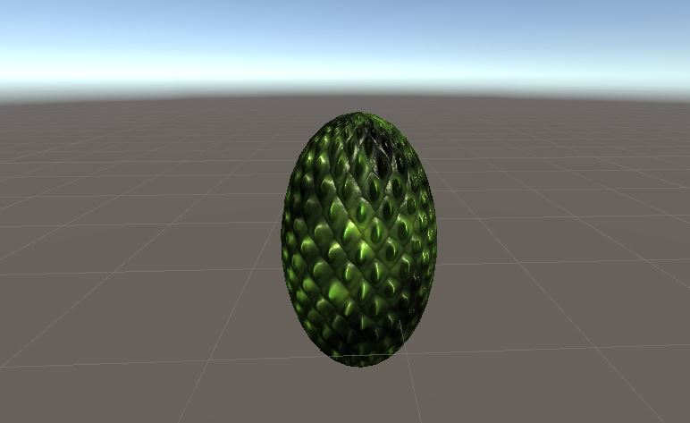

7) Создать префаб сферу EnergyShield, добавить текстуру.

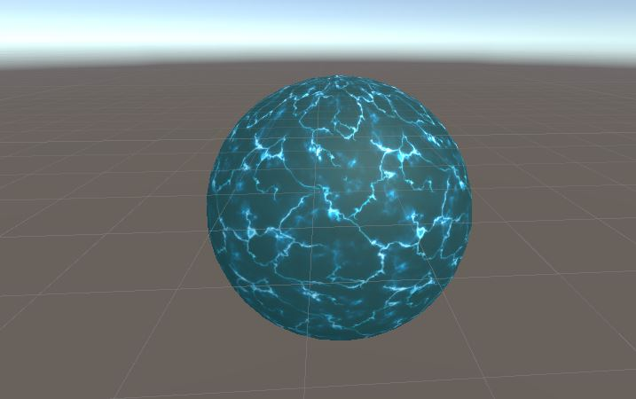

#### Работа 2

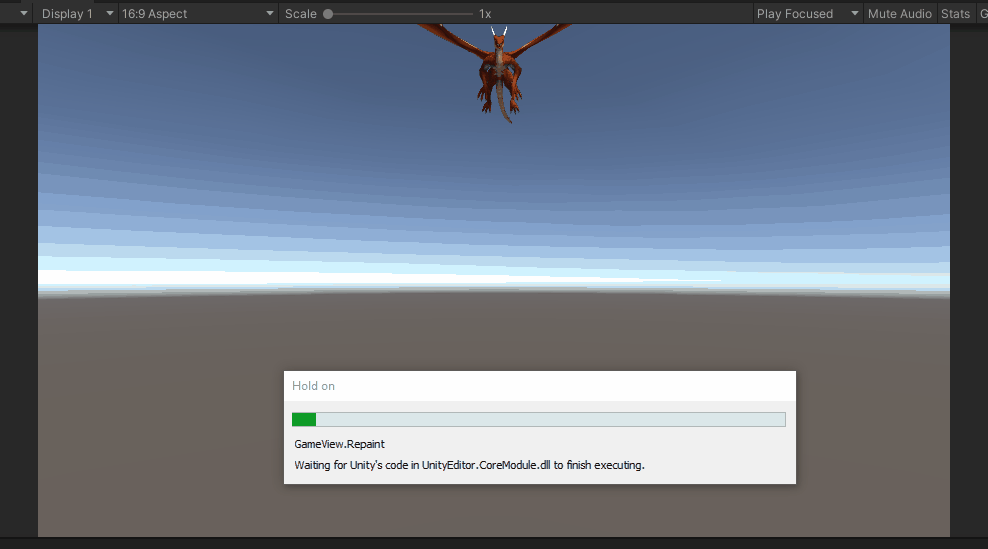

1) Переместить камеру, чтобы дракон находился вверху экрана. 
2) Создать и добавить дракону скрипт:
```cs
using UnityEngine;

namespace DragonPicker
{
    [RequireComponent(typeof(Rigidbody))]
    public class DragonMovement : MonoBehaviour
    {
        [Range(0f, 50f)][SerializeField] private float speed;
        [Range(0f, 30f)][SerializeField] private float timeBetweenEggDrops;
        [Range(0f, 100f)][SerializeField] private float horizontalDistance;
        [Tooltip("Per physics update")]
        [Range(0f, 1f)][SerializeField] private float changeDirectionChance;

        [Header("Prefabs")]
        [SerializeField] private GameObject egg;

        private new Rigidbody rigidbody;
        private Vector3 startingPosition;
        private Vector3 movementDirection = Vector3.right;

        private void Awake()
        {
            rigidbody = GetComponent<Rigidbody>();
        }

        private void Start()
        {
            startingPosition = transform.position;
            rigidbody.velocity = movementDirection * speed;
        }

        private void FixedUpdate()
        {
            if (rigidbody.position.x - startingPosition.x > horizontalDistance / 2)
            {
                movementDirection = Vector3.left;
            }
            else if (rigidbody.position.x - startingPosition.x < -horizontalDistance / 2)
            {
                movementDirection = Vector3.right;
            }
            else if (Random.value < changeDirectionChance)
            {
                movementDirection *= -1;
            }
            rigidbody.velocity = movementDirection * speed;
        }
    }
}
``` 
3) Указать в компоненте параметры:

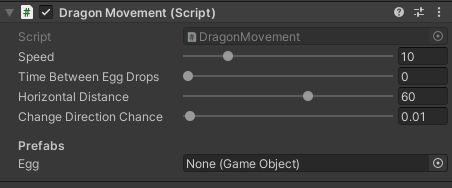

#### Работа 3

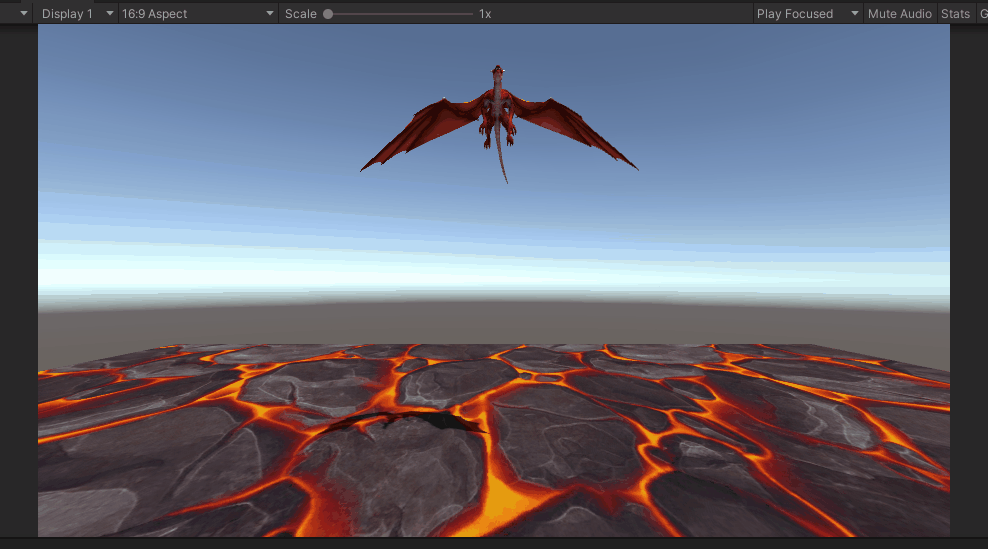

1) Создать и добавить дракону скрипт:
```cs
using System.Collections;
using UnityEngine;

namespace DragonPicker
{
    public class EggDropper : MonoBehaviour
    {
        [Range(0f, 30f)][SerializeField] private float timeBetweenEggDrops;
        [Range(-10f, 10f)][SerializeField] private float spawnVerticalDistance;

        [Header("Prefabs")]
        [SerializeField] private GameObject eggPrefab;

        private void Start()
        {
            StartCoroutine(EggDroppingCoroutine());
        }

        private IEnumerator EggDroppingCoroutine()
        {
            yield return new WaitForSeconds(2);
            while (true)
            {
                var egg = Instantiate(eggPrefab);
                egg.transform.position = transform.position + Vector3.down * spawnVerticalDistance;
                yield return new WaitForSeconds(timeBetweenEggDrops);
            }
        }
    }
}
```
2) Настроить скрипт.

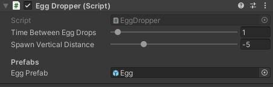

3) Создать объект Plane, увеличить, сохранить как префаб Ground, скачать и добавить текстуру и материал.
#### Работа 4


1) Скачать и импортировать ассет эффектов.

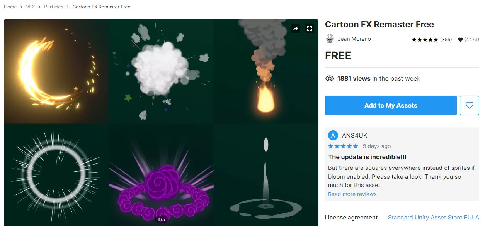

2) Добавить в Egg скрипт взрыва при столкновении и добавить в него префаб взрыва:
```cs
using UnityEngine;

namespace DragonPicker
{
    public class EggExplosion : MonoBehaviour
    {
        [SerializeField] private GameObject explosionEffectPrefab;

        private void OnCollisionEnter()
        {
            var explosion = Instantiate(explosionEffectPrefab);
            explosion.transform.position = transform.position;
            Destroy(gameObject);
        }
    }
}
```
3) Создать префаб EnergyShield, который состоит из 3 слоёв с разными значениями Scale.

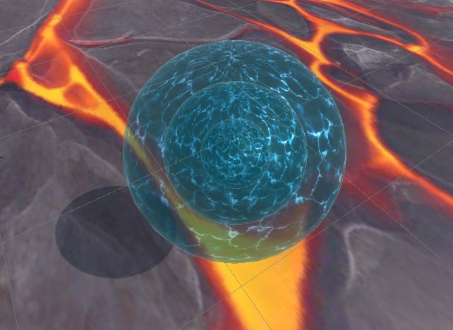


## Задание 2
### В проект, выполненный в предыдущем задании, добавить систему проверки того, что SDK подключен (доступен в режиме онлайн и отвечает на запросы)
Ход работы:
1) Импортировать PluginYG в проект. Добавить на сцену объект YandexGame.
2) Добавить к новому пустому объекту скрипт:
```cs
using UnityEngine;
using TMPro;
using YG;
using System;
using UnityEngine.Events;

namespace DragonPicker
{
    public class YandexSdkManager : MonoBehaviour
    {
        [SerializeField] private TextMeshProUGUI textField;
        [SerializeField] private UnityEvent authorizationCheck;

        private bool isFirstLaunch = true;

        public void ResolvedAuthorization()
        {
            textField.text = $"SDK available\nResolved authorization\nPlayer name: \"{YandexGame.playerName}\"";
        }

        public void RejectedAuthorization()
        {
            textField.text = $"SDK available\nRejected authorization";
        }

        private void OnEnable() => YandexGame.GetDataEvent += SdkDataReceived;

        private void OnDisable() => YandexGame.GetDataEvent -= SdkDataReceived;

        private void SdkDataReceived()
        {
            if (YandexGame.SDKEnabled && isFirstLaunch)
            {
                textField.text = $"SDK available\nWaiting for authorization...";
                authorizationCheck?.Invoke();
                isFirstLaunch = false;
            }
        }
    }
}
```
3) Настроить его.

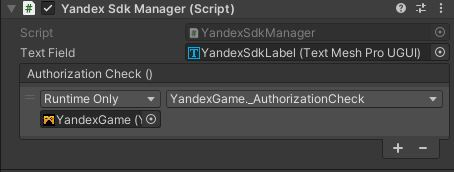

4) Добавить в события YandexGame ссылки на наши методы.

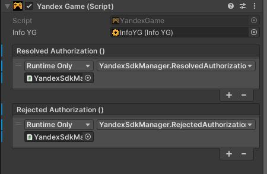

5) Настроить билд: WebGL Template поставить на PluginYG; отключить Run in background; включить Decompression Fallback в Publishing Settings.
6) Сделать WebGL билд, запаковать в .zip архив.
7) Зарегистрироваться на https://games.yandex.ru
8) Зайти в консоль разработчика, добавить новое приложение и указать поддерживаемые платформы.

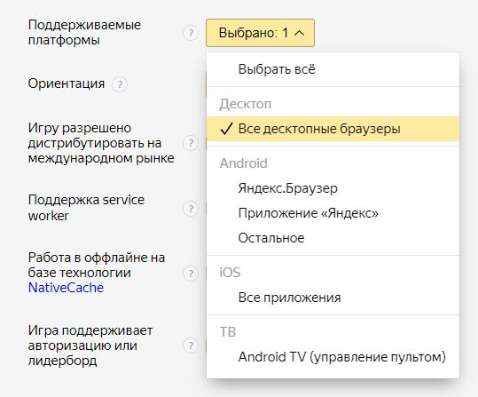

9) Добавить архив с билдом в Исходники. Подождать пока его проверят.

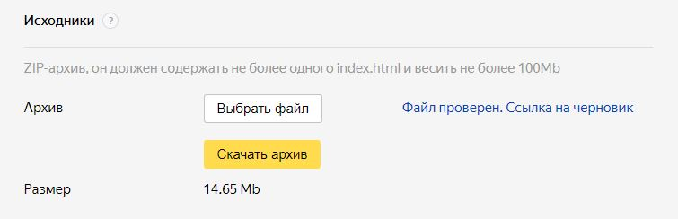

10) Теперь игру можно запустить на серверах Yandex по ссылке: https://yandex.ru/games/app/197771?draft=true&lang=ru. SDK подключается, правильно отображается имя игрока. В приватном окне автоматической авторизации не происходит.


## Выводы

Ознакомился с основными функциями Unity и взаимодействием с объектами внутри редактора. Ознакомился с правилами оформления отчёта.

## Powered by

**BigDigital Team: Denisov | Fadeev | Panov**
